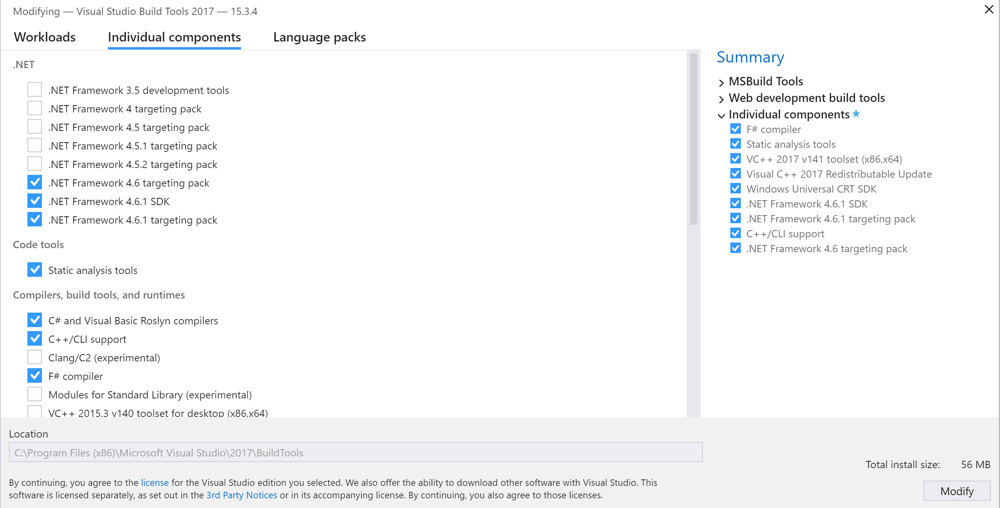
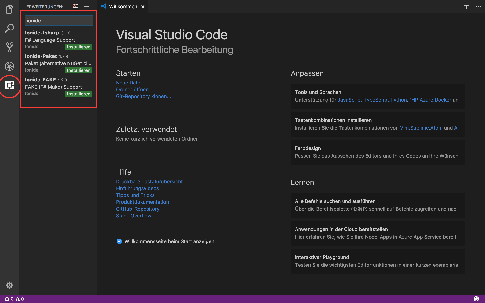

# IDE Installation Instruction 
## For Mac 

- Install [fsharp](http://fsharp.org/use/mac/) using option #5:
  
  - Install [homebrew](https://brew.sh/index_de.html)

  ```shell
  /usr/bin/ruby -e "$(curl -fsSL https://raw.githubusercontent.com/Homebrew/install/master/	install)“
```
  
  - The script explains what it will do and then pauses before it does it. There are more installation options.

  - After installation run:

  ```shell
  brew install mono
  ```
   in the terminal to install mono and f#


- Install node.js:

```shell
brew install node.js
```

- Install npm:	

```shell
brew install npm
```

- Install git:	

```shell
brew install git
```

- Install flatbuffers:

```shell
brew install flatbuffers
```

- Download and install [.NET Core SDK](https://www.microsoft.com/net/core#macos)

## For Windows

- Install [chocolatey](https://chocolatey.org/install)

- Via chocolatey install:
 
  - Visual Studio Code: 

  ```shell
  choco install visualstudiocode
  ```

  - Microsoft Build Tools: 

  ```shell
  choco install microsoft-build-tools
  ```

  - Windows SDK: 

  ```shell
  choco install windows-sdk-8.0 -y
  ```
  
  - Visual Fsharp Tools: 

  ```shell
  choco install visualfsharptools -y
  ```

  - node.js: 

  ```shell
  choco install nodejs
  ```

  - Git: 

  ```shell
  choco install git
  ```

  - dotnet:

  ```shell
  choco install dotnetcore-sdk
  ```


- Download and install [.NET Core 2.0](https://www.microsoft.com/net/download/core)
- Install „Build Tools for Visual Studio 2017“ [from here]( https://www.visualstudio.com/de/downloads/)


- Pick the following selection (Summary)



## Setting up Visual Studio Code

- For Mac, install [Visual Studio Code](https://code.visualstudio.com/Download)

- Open Visual Studio Code and under add-ons search for „ionide“. Install all 3 packages



## Setting up the Git repository

- Got to [Bitbucket](https://bitbucket.org/nsynk/disco/src/d3a8c95ab2762f9eb8b74da12d5e11ee7ac16cbe/dotnet/docs/files/frontend/quickstart.md?at=master&fileviewer=file-view-default)
- Select "Clone this repository" and copy the clone command
- Open a Terminal window and change to the local directory you want to clone to
- Paste the command you copied from Bitbucket

## Building

- In your local repository run: 

```shell
  git checkout master
```

- Make sure you don't have any unsaved changes since you will loose them otherwise. Switch to root folder (Disco) and run:

```shell
  git clean -xfd
```

```shell
  git pull
```

```shell
  sh build.sh BootStrap
```

```shell
  npm run build
```


When the webpack-dev-server has finished compiling the code, you can open `[FRONTEND_IP]:3000` in your browser.

> To run Disco Frontend in **Design Mode** (using mock data instead of connecting with Disco server), set the environmental variable `FRONTEND_IP` to `localhost` (e.g. `export FRONTEND_IP=localhost`), and open `localhost:3000` in your browser.


